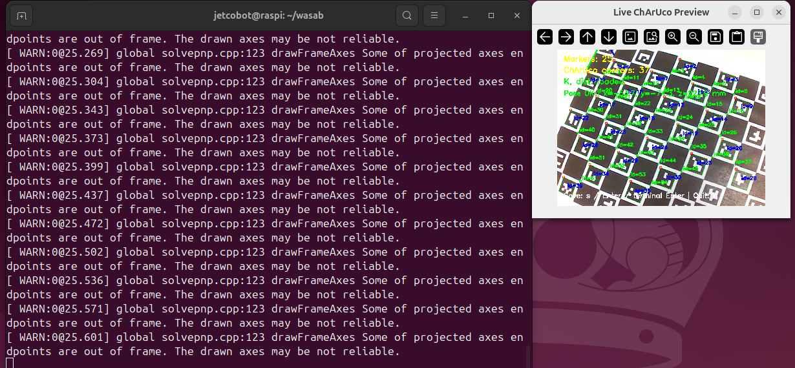
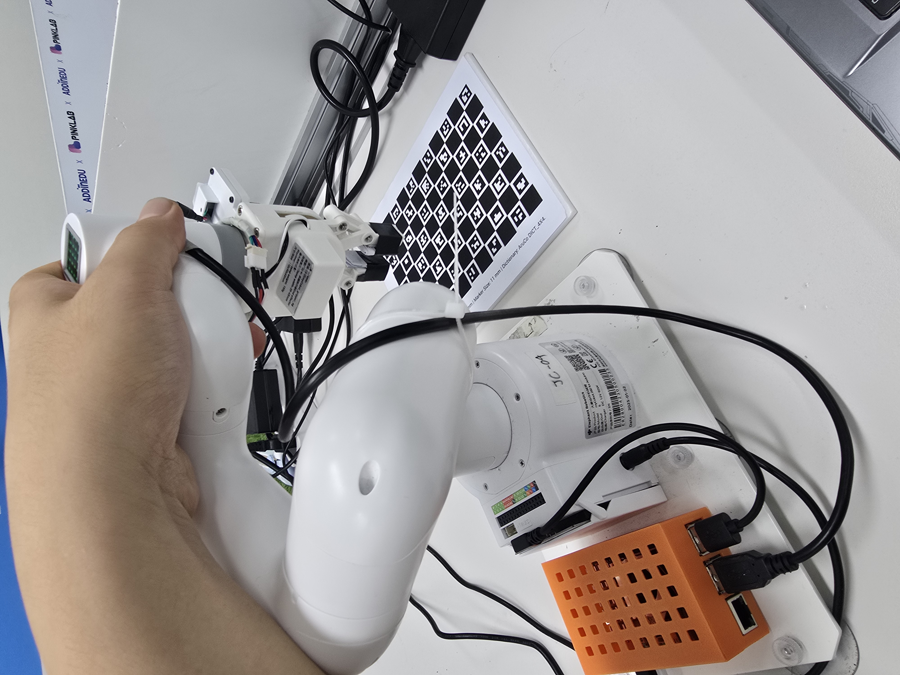

# Jetcobot-manipulation_server

## 1. 노트북 준비

`robot_client/`, `config/`이 포함된 이 폴더 전체를 노트북에 둡니다.

### Ubuntu Terminal

```mkdir client
cd client
python3 -m venv ~/venv/client
source ~/venv/client/bin/activate
pip install -r requirements.txt
```

## 2. 수동 카메라 캘리브레이션

`client/marker.py`를 실행하여 최소 10개 이상의 다른 위치에서 Charuco Board를 촬영합니다.
높은 캘리브레이션 결과를 얻기 위해 다양한 위치에서 위치마다 관절의 변화를 많이 주어 촬영하는것이 좋습니다.

코드를 GUI 환경(VNC 등을 이용한)에서 실행하여 촬영이 잘 찍히는지 확인하면서 고정된 위치에서 S를 눌러 저장합니다.
10개 이상의 위치 샘플이 모였다면 Q를 눌러 캘리브레이션 결과를 산출합니다.




### Ubuntu Terminal

```cd client
python3 run_cilent.py
```
결과물로 `client/camera_intrinsic_charuco.npz`, `client/camera_intrinsic_charuco.npz`이 생성됩니다.

## 3. 자동 카메라 캘리브레이션

수동 카메라 캘리브레이션은 

### Ubuntu Terminal

```mkdir client
cd client
python3 -m venv ~/venv/client
source ~/venv/client/bin/activate
pip install -r requirements.txt
```

## 4. 서버 설정 

`robot_client/`, `config/`이 포함된 이 폴더 전체를 노트북에 둡니다.

### Ubuntu Terminal

```mkdir client
cd client
python3 -m venv ~/venv/client
source ~/venv/client/bin/activate
pip install -r requirements.txt
```

## 5. pick & place 및 throw 기능

`robot_client/`, `config/`이 포함된 이 폴더 전체를 노트북에 둡니다.

### Ubuntu Terminal

```mkdir client
cd client
python3 -m venv ~/venv/client
source ~/venv/client/bin/activate
pip install -r requirements.txt
```