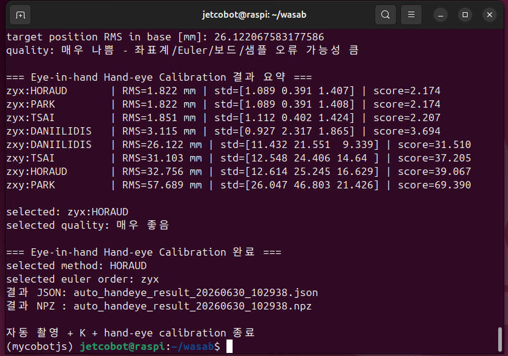
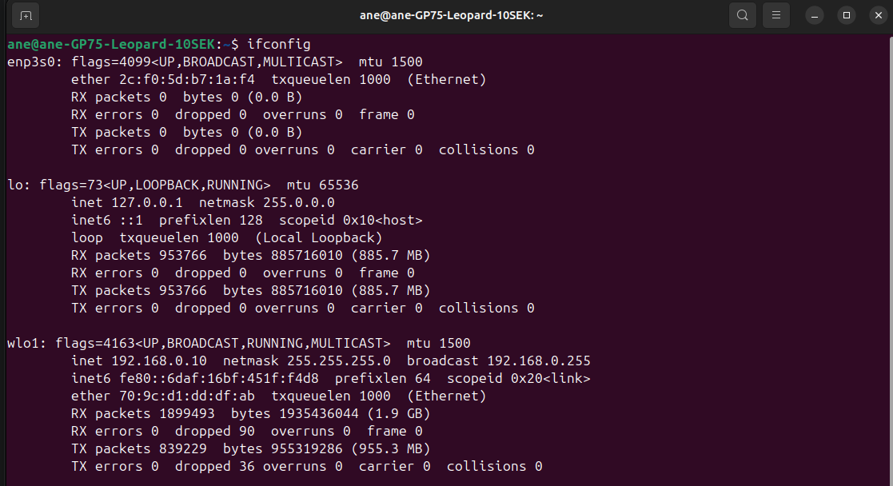

# Jetcobot-manipulation_arm

## 1. 노트북 준비

`robot_client/`, `config/`이 포함된 이 폴더 전체를 노트북에 둡니다.

### Ubuntu Terminal

```mkdir client
cd client
python3 -m venv ~/venv/client
source ~/venv/client/bin/activate
pip install -r requirements.txt
```

## 2. 수동 카메라 캘리브레이션

`client/marker.py`를 실행하여 최소 10개 이상의 다른 위치에서 Charuco Board를 촬영합니다.
높은 캘리브레이션 결과를 얻기 위해 다양한 위치에서 위치마다 관절의 변화를 많이 주어 촬영하는것이 좋습니다.

코드를 GUI 환경(VNC 등을 이용한)에서 실행하여 촬영이 잘 찍히는지 확인하면서 고정된 위치에서 S를 눌러 저장합니다.
10개 이상의 위치 샘플이 모였다면 Q를 눌러 캘리브레이션 결과를 산출합니다.


<p align="center">
  <br>
  <em>그림 1. run_cilent.py 실행화면</em>
</p>

<p align="center">
  <br>
  <em>그림 2. Jetcobot 캘리브레이션 조작과정</em>
</p>

### Ubuntu Terminal

```cd client
python3 run_cilent.py
```
결과물로 `client/camera_intrinsic_charuco.npz`등이 생성됩니다.

## 3. 자동 카메라 캘리브레이션

수동 카메라 캘리브레이션은 위치마다 촬영 과정에서 손 떨림 등의 문제가 발생하여 캘리브레이션 결과가 조잡할 수 있음
따라서 수동 카메라 캘리브레이션 과정을 통해 여러 위치를 기반으로 자동으로 비슷한 위치에 이동해서 
더 많은 위치의 사진을 안정적으로 찍는 자동 카메라 캘리브레이션을 수행

auto_marker.py 내부의

MAX_AUTO_SAMPLES 파라미터를 조정하여 촬영한 샘플 갯수 조정
SPEED 파라미터를 조정하여 Jetcobot의 자동 촬영 스피드 조정

촬영 샘플의 갯수는 30장 이상, SPEED 파라미터는 백래쉬등의 현상으로 인해 느린 스피드를 추천

### Ubuntu Terminal

```cd client
python3 auto_marker.py
```

<p align="center">
  <br>
  <em>그림 3. auto_marker.py 실행과정</em>
</p>

결과물로 `client/auto_camera_intrinsic_charuco_20260630_102938.npz`,
`client/auto_handeye_charuco_samples_20260630_102938.npz`,
`client/auto_handeye_result_20260630_102938.json`, 
`client/auto_handeye_result_20260630_102938.npz`,이 생성됩니다.

## 4. 서버 및 Jetcobot 파라미터 설정 

2,3번 과정을 수행한 결과물인
`client/camera_intrinsic_charuco.npz`과
`client/auto_handeye_result_20260630_102938.json`을 

`dl_server/calibration`로 옮긴 후
`dl_server/config/server_config.ini` 파일의

intrinsic_file
handeye_result_json

파라미터를 결과물의 이름으로 수정합니다.

또한 적절히 다른 파라미터들에 관해서도 환경에 맞게 수정할 부분을 수정합니다.

`client/config/client_config.ini` 에서는 대표적으로

grasp_server_url
home_flange_coords 를 수정합니다.

grasp_server_url은 노트북 터미널에서 ifconfig를 수행한 이후 아래 이미지와 같이 wlo1의 inet 주소를 확인하여
grasp_server_url = http://<inet 주소>:8000/v1/grasp-plan로 설정합니다.

home_flange_coords는 from pymycobot.mycobot280 import MyCobot280의 coords = mc.get_coords()의 값으로 
원하는 위치를 설정합니다. 

<p align="center">
  <br>
  <em>노트북 터미널 ifconfig 실행 결과</em>
</p>


## 5. pick & place 및 throw 기능

`robot_client/`, `config/`이 포함된 이 폴더 전체를 노트북에 둡니다.

### Ubuntu Terminal

```mkdir client
cd client
python3 -m venv ~/venv/client
source ~/venv/client/bin/activate
pip install -r requirements.txt
```